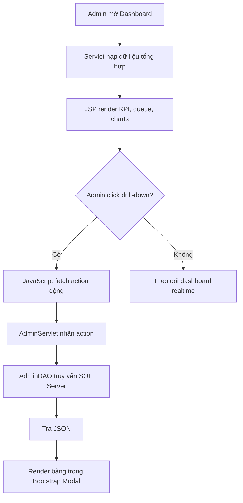

# CASE STUDY VÀ LUỒNG VẬN HÀNH KHU VỰC ADMIN - S-COMS

## 1. Mục tiêu tài liệu

Tài liệu này mô tả ngắn gọn nhưng có cấu trúc về case study khu vực Admin trong S-COMS, tập trung vào luồng vận hành thực tế từ dashboard, drill-down dữ liệu, đến các hành động quản trị danh mục và lịch trực.

## 2. Bối cảnh case study

### 2.1 Vấn đề thực tế

Khu vực phòng khám cần một giao diện điều hành theo thời gian thực để:
- Theo dõi số lượt khám trong ngày.
- Phát hiện nhanh điểm nghẽn hàng đợi bác sĩ.
- Kiểm soát doanh thu theo dịch vụ và trạng thái ca khám.
- Can thiệp vận hành ngay tại chỗ qua modal drill-down.

### 2.2 Mục tiêu của phân hệ Admin

- Chuẩn hóa dữ liệu quản trị và quy trình tác nghiệp.
- Tăng tốc độ ra quyết định khi có tải cao.
- Giảm thao tác chuyển trang bằng mô hình modal + fetch API.
- Giữ tính toàn vẹn dữ liệu lịch sử (đặc biệt danh mục dịch vụ và hóa đơn).

## 3. Thành phần chính trong khu vực Admin

### 3.1 Front-End

- dashboard.jsp
- reports.jsp
- schedule-management.jsp
- services.jsp

### 3.2 Back-End

- AdminServlet.java: điều phối action và trả dữ liệu JSON/JSP.
- AdminDAO.java: truy vấn SQL Server theo từng use case.

### 3.3 Dữ liệu nghiệp vụ trọng tâm

- Account
- Medical_Service
- Doctor_Schedule
- Appointment
- Invoice
- Invoice_Detail

## 4. Use case cốt lõi

| Mã | Nhóm chức năng | Mô tả ngắn |
|---|---|---|
| FR-ADM-01 | Quản lý tài khoản | Tạo/sửa phân quyền, khóa/mở khóa |
| FR-ADM-03 | Quản lý danh mục y tế | Bật/tắt dịch vụ Active/Inactive |
| FR-ADM-04 | Quản lý lịch trực | Tạo và lọc lịch theo bác sĩ/chuyên khoa/ngày |
| FR-ADM-05 | Điều tiết tải ca trực | Theo dõi mức tải và trạng thái slot |
| FR-ADM-06 | Báo cáo doanh thu | Phân tích doanh thu và hóa đơn |
| FR-ADM-07 | Báo cáo lượt khám | Phân tích lưu lượng, trạng thái, drill-down |

## 5. Luồng vận hành tổng quát (Admin)



## 6. Luồng chi tiết theo màn hình

### 6.1 Dashboard vận hành trong ngày

- Bước 1: Trang được tải với dữ liệu tổng hợp qua JSTL/EL.
- Bước 2: Chart.js vẽ 3 biểu đồ vận hành.
- Bước 3: Click vào card hoặc dòng hàng đợi để mở modal chi tiết.
- Bước 4: JavaScript gọi fetch đến AdminServlet theo action.
- Bước 5: Servlet trả JSON, front-end render lại tbody.

### 6.2 Quản lý lịch trực

- Lọc theo chuyên khoa, bác sĩ, ngày trực.
- Hiển thị mức tải theo phần trăm và trạng thái slot.
- Chuẩn hóa hiển thị tiếng Việt (chuyên khoa, trạng thái, định dạng ngày).

### 6.3 Quản lý dịch vụ

- Không khuyến nghị xóa vật lý dịch vụ đã tham gia hóa đơn.
- Sử dụng cập nhật trạng thái Active/Inactive để bảo toàn lịch sử.

## 7. Quy tắc dữ liệu và ràng buộc vận hành

### 7.1 Lọc dữ liệu trong ngày

Đa số widget/chart/dashboard drill-down dùng điều kiện:

```sql
CAST(created_at AS DATE) = CAST(GETDATE() AS DATE)
```

Hoặc với dữ liệu lịch hẹn:

```sql
CAST(appointment_time AS DATE) = CAST(GETDATE() AS DATE)
```

### 7.2 Quy chuẩn trạng thái hiển thị

| Trạng thái DB | Hiển thị UI | Màu badge |
|---|---|---|
| Waiting | Đang chờ | warning |
| In_Progress | Đang khám | info |
| Completed | Đã hoàn tất | success |

## 8. Case study thực thi gần đây (tóm tắt)

- Tái cấu trúc dashboard theo hướng vận hành realtime.
- Thêm cụm widget trong ngày + 3 biểu đồ Chart.js.
- Bổ sung modal drill-down cho:
  - Lượt khám hôm nay
  - Danh sách bệnh nhân chờ
  - Hàng đợi theo bác sĩ
  - Hóa đơn gần nhất trong ngày
- Chuẩn hóa hiển thị tiếng Việt và định dạng thời gian thanh toán dd/MM/yyyy HH:mm.

## 9. Rủi ro kỹ thuật và khuyến nghị

### 9.1 Rủi ro

- Chênh lệch mapping patient_id giữa bảng Patient và Account ở dữ liệu cũ.
- Một số cột thời gian có thể khác nhau giữa môi trường seed và môi trường thật.
- Nhiều action JSON trong cùng servlet có thể khó bảo trì khi mở rộng.

### 9.2 Khuyến nghị

- Chuẩn hóa DTO JSON cho từng modal để dễ versioning.
- Tách service layer khi số lượng action tăng cao.
- Bổ sung kiểm thử integration cho action drill-down quan trọng.

## 10. Kết luận

Khu vực Admin của S-COMS hiện theo mô hình vận hành hiệu quả: tải nhanh dữ liệu tổng hợp, drill-down động theo ngữ cảnh, và có khả năng mở rộng tốt nếu tiếp tục chuẩn hóa tầng API/DTO trong giai đoạn tiếp theo.
