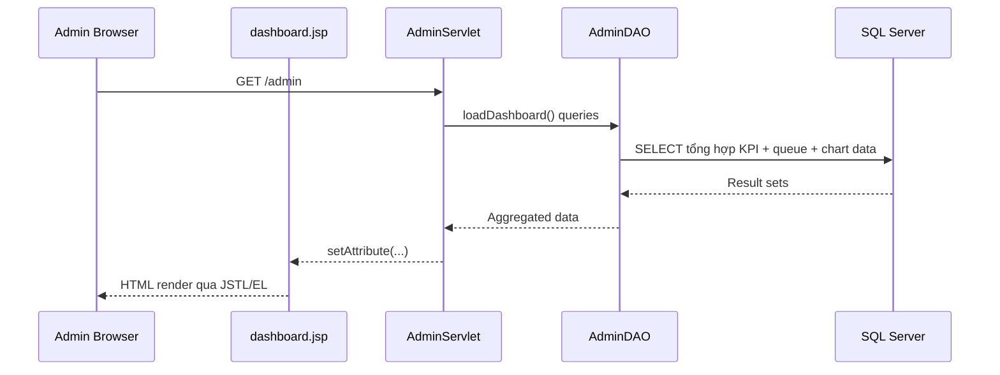
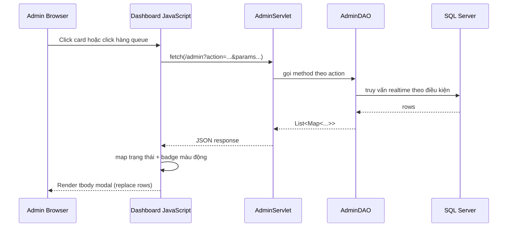

# TÀI LIỆU CẤU TRÚC PHẦN MỀM VÀ LOGIC VẬN HÀNH PHÂN HỆ ADMIN - HỆ THỐNG S-COMS

## 1) TỔNG QUAN PHÂN HỆ (Overview)

Phân hệ Admin của S-COMS đóng vai trò trung tâm trong quản trị hệ thống và điều hành vận hành phòng khám theo thời gian thực. Phân hệ này vừa đảm nhiệm nhóm tác vụ cấu hình dữ liệu nền (master data), vừa cung cấp khả năng giám sát tác nghiệp (Operational Dashboard) để ra quyết định nhanh.

### Vai trò chính của Admin

- Quản trị tài khoản và phân quyền người dùng trong hệ thống.
- Quản lý danh mục y tế (dịch vụ, trạng thái hoạt động) theo nguyên tắc bảo toàn dữ liệu lịch sử.
- Quản lý cấu hình lịch trực bác sĩ, kiểm soát tải bệnh nhân theo ca.
- Theo dõi dashboard vận hành trong ngày với biểu đồ trực quan và cơ chế drill-down động qua Pop-up Modal.
- Khai thác báo cáo chuyên sâu doanh thu và lượt khám theo kỳ.

### Danh sách Use Cases cốt lõi

| Mã FR | Chức năng | Mục tiêu vận hành |
|---|---|---|
| FR-ADM-01 | Quản lý tài khoản | Tạo/cập nhật vai trò, khóa/mở khóa tài khoản, kiểm soát truy cập |
| FR-ADM-03 | Quản lý danh mục y tế | Duy trì danh mục dịch vụ khám/xét nghiệm, bật/tắt trạng thái sử dụng |
| FR-ADM-04 | Quản lý lịch trực | Tạo, chỉnh sửa, hủy lịch trực bác sĩ theo ngày/khung giờ |
| FR-ADM-05 | Cấu hình tải ca trực | Thiết lập max_patients và theo dõi mức tải theo thời gian thực |
| FR-ADM-06 | Báo cáo doanh thu | Phân tích doanh thu theo ngày/tháng/năm, chi tiết hóa đơn |
| FR-ADM-07 | Báo cáo lượt khám | Phân tích lưu lượng khám, trạng thái ca khám và drill-down danh sách |

---

## 2) CẤU TRÚC TỆP TIN VÀ THƯ MỤC (Directory Structure)

### 2.1 Mô hình tham chiếu theo đặc tả Java Web MVC

```text
WebContent/
└── views/
    └── admin/
        ├── dashboard.jsp
        ├── reports.jsp
        ├── schedule-management.jsp
        └── services-management.jsp

src/
├── controller/
│   └── admin/
│       └── AdminServlet.java
├── dao/
│   └── AdminDAO.java
└── model/
    ├── Account.java
    ├── MedicalService.java
    ├── DoctorSchedule.java
    ├── Appointment.java
    └── Invoice.java
```

### 2.2 Ánh xạ với cấu trúc triển khai hiện tại trong S-COMS

```text
web/admin/
├── dashboard.jsp
├── reports.jsp
├── schedule-management.jsp
├── services.jsp
└── (các màn hình admin khác)

src/java/com/diabetes/monitoring/
├── servlet/
│   └── AdminServlet.java
├── dao/
│   └── AdminDAO.java
└── model/
    ├── User.java
    ├── HealthRecord.java
    ├── PatientRecord.java
    └── (các model nghiệp vụ liên quan)
```

### 2.3 Ghi chú chuẩn hóa naming

- services-management.jsp trong mô hình tham chiếu tương đương services.jsp trong cấu trúc hiện tại.
- Nhóm Entity có thể được biểu diễn bằng tên bảng nghiệp vụ trong DAO/SQL (Account, Medical_Service, Doctor_Schedule, Appointment, Invoice) dù model Java có thể gom/đặt tên khác.

---

## 3) ĐẶC TẢ QUY TRÌNH LUỒNG DỮ LIỆU ĐỘNG (Data Flow & Interaction Model)

### 3.1 Kiến trúc MVC áp dụng

- View layer: JSP + JSTL/EL + Bootstrap + Chart.js.
- Controller layer: AdminServlet điều phối action từ query parameter.
- Data layer: AdminDAO truy vấn SQL Server và trả về cấu trúc dữ liệu dạng List<Map<String,Object>> hoặc DTO tương đương.

### 3.2 Luồng 1: Render dữ liệu tổng hợp khi tải trang



Kết quả:
- KPI và widget hiển thị ngay tại lần tải đầu.
- Bảng hàng đợi và biểu đồ vận hành được dựng tức thời bằng dữ liệu đã bind sẵn.

### 3.3 Luồng 2: Drill-down bất đồng bộ qua Ajax Fetch API



### 3.4 Mô tả hành vi UI động trên Dashboard

- Click vào card thống kê trong ngày:
  - Mở Bootstrap Modal tương ứng.
  - Gọi action JSON endpoint để lấy danh sách chi tiết.
  - Xóa dữ liệu cũ trong tbody, render dữ liệu mới theo response.

- Click vào dòng bác sĩ tại bảng hàng đợi:
  - Mở modal hàng đợi theo bác sĩ.
  - Truy vấn danh sách bệnh nhân Waiting theo doctorId trong ngày.

- Badge trạng thái động:
  - Waiting -> Đang chờ -> badge bg-warning text-dark.
  - In_Progress -> Đang khám -> badge bg-info text-white.
  - Completed -> Đã hoàn tất -> badge bg-success text-white.

---

## 4) THIẾT KẾ CƠ SỞ DỮ LIỆU LIÊN QUAN (Database Schema Constraints)

### 4.1 Bảng nghiệp vụ trọng tâm

| Bảng | Vai trò | Cột quan trọng |
|---|---|---|
| Medical_Service | Danh mục dịch vụ y tế | service_id, service_name, service_type, price, status |
| Doctor_Schedule | Cấu hình lịch trực bác sĩ | schedule_id, doctor_id, work_date, time_slot, max_patients, status |
| Appointment | Quản lý lượt khám | appointment_id, patient_id, doctor_id/schedule_id, appointment_time, created_at, status |
| Invoice | Quản lý hóa đơn | invoice_id, appointment_id, final_amount, status, created_at |
| Invoice_Detail | Dòng chi tiết hóa đơn | invoice_id, service_id, quantity, unit_price, line_total |

### 4.2 Ràng buộc nghiệp vụ cốt lõi

1. Medical_Service không xóa vật lý dữ liệu đang dùng trong lịch sử hóa đơn.
- Ưu tiên chuyển trạng thái Active/Inactive.
- Đảm bảo Data Integrity của chứng từ đã phát sinh.

2. Appointment và Doctor_Schedule kiểm soát tải theo max_patients.
- Tải hiện tại = số ca đang hoạt động theo schedule.
- Tỷ lệ tải (%) = activeAppointments / max_patients.
- Trạng thái slot có thể chuyển Full khi vượt ngưỡng.

3. Ràng buộc thời gian cho dashboard trong ngày.
- Truy vấn vận hành dùng điều kiện:

```sql
CAST(created_at AS DATE) = CAST(GETDATE() AS DATE)
```

- Áp dụng cho KPI, widget, chart và drill-down modal trong ngày.

### 4.3 Quy ước trạng thái vận hành

| Nhóm | Trạng thái DB | Ý nghĩa hiển thị |
|---|---|---|
| Appointment | Waiting | Đang chờ |
| Appointment | In_Progress | Đang khám |
| Appointment | Completed | Đã hoàn tất |
| Doctor_Schedule | Available | Khả dụng |
| Doctor_Schedule | Full | Đã đầy |
| Doctor_Schedule | Cancelled | Đã hủy |

---

## 5) CÔNG CỤ VÀ THƯ VIỆN FRONT-END (Tech Stack Visual)

### 5.1 Thành phần chính

| Thành phần | Vai trò trong Admin Dashboard |
|---|---|
| Bootstrap 5 | Grid layout, table responsive, modal popup, badge/button style |
| JSTL/EL | Render dữ liệu server-side ban đầu và điều kiện hiển thị |
| Fetch API | Giao tiếp bất đồng bộ với AdminServlet, nhận JSON realtime |
| Chart.js | Trực quan hóa vận hành (line, doughnut, pie) |

### 5.2 Cấu hình Chart.js cho 3 biểu đồ vận hành

1. Lưu lượng theo giờ (Line Chart)
- Trục X: time_slot.
- Trục Y: số lượt khám.
- Mục tiêu: phát hiện khung giờ cao điểm.

2. Doanh thu theo dịch vụ (Doughnut)
- Nhóm dữ liệu: Examination vs Lab_Test.
- Mục tiêu: cơ cấu doanh thu theo loại dịch vụ trong ngày.

3. Tỷ lệ trạng thái ca khám (Pie)
- Waiting / In_Progress / Completed.
- Mục tiêu: quan sát nhanh áp lực tác nghiệp hiện tại.

### 5.3 Quy chuẩn màu nhãn động (Queue Pressure & Status)

| Ngữ cảnh | Điều kiện | Màu/Biểu diễn |
|---|---|---|
| Queue load badge | waitingCount = 0 | Secondary (xám) |
| Queue load badge | 1 <= waitingCount <= 5 | Warning (vàng) |
| Queue load badge | waitingCount > 5 | Danger (đỏ, có pulse) |
| Status badge | Waiting | Warning (vàng nhạt) |
| Status badge | In_Progress | Info (xanh biển) |
| Status badge | Completed | Success (xanh lá) |

---

## Phụ lục: Mẫu hợp đồng JSON cho luồng drill-down

### A. Chi tiết ca khám hôm nay

```json
{
  "items": [
    {
      "appointmentId": 123,
      "patientName": "Nguyen Van A",
      "doctorName": "BS Tran Thi B",
      "appointmentTime": "09:30",
      "status": "In_Progress"
    }
  ]
}
```

### B. Chi tiết hàng đợi theo bác sĩ

```json
{
  "items": [
    {
      "appointmentId": 456,
      "patientName": "Le Van C",
      "appointmentTime": "10:10",
      "status": "Waiting"
    }
  ]
}
```

### C. Chi tiết bệnh nhân đang chờ trong ngày

```json
{
  "items": [
    {
      "appointmentId": 789,
      "patientName": "Pham Thi D",
      "department": "Nội tiết - Tiểu đường",
      "appointmentTime": "11:00",
      "status": "Waiting",
      "waitingMinutes": 24
    }
  ]
}
```

---

## Kết luận

Tài liệu này chuẩn hóa góc nhìn kiến trúc từ giao diện đến dữ liệu cho phân hệ Admin S-COMS, đồng thời mô tả đầy đủ các luồng tương tác realtime phục vụ vận hành phòng khám. Với cách tổ chức MVC + Ajax drill-down + badge trạng thái động, hệ thống đạt được khả năng theo dõi trực quan, phản ứng nhanh và đảm bảo toàn vẹn dữ liệu nghiệp vụ trong quá trình quản trị.
